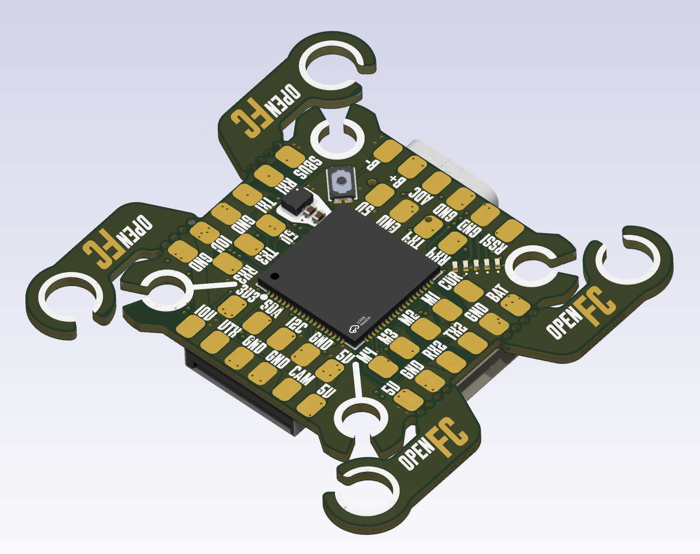

# OpenFC-Lite

Open-source Betaflight flight controller built on the RP2354B — 6-layer, 30.5×30.5 mm mounting, 3S–6S input, microSD blackbox, analog OSD.

<p>


</p>

Motor outputs are signal-level lines that drive an external 4-in-1 ESC (e.g. OpenESC) over the 8-pin ESC connector — there are no onboard motor drivers. Barometer, integrated receiver, and onboard SPI blackbox flash are omitted by design; blackbox logging uses the microSD slot, and the receiver connects externally over UART.

> A smaller **[OpenFC-Lite-Mini](https://github.com/incutec-hw/OpenFC-Lite-Mini)** (20×20 mm, RP2354A) shares this design.
>
> 📖 **Build, flashing, and bring-up/testing notes live in the [Wiki](https://github.com/incutec-hw/OpenFC-Lite/wiki).** This README is the canonical board reference. Per-sheet engineering rationale is in [`hardware/DESIGN_NOTES.md`](hardware/DESIGN_NOTES.md).

## Specifications

| | |
|---|---|
| **MCU** | RP2354B — dual-core ARM Cortex-M33, QFN-80, integrated stacked flash (U2, LCSC C39843328) |
| **IMU** | 6-axis MEMS on SPI0, LGA-14 footprint. Rev 1 populates LSM6DSV16XTR (U9). The footprint also accepts TDK ICM-426xx/456xx — IMU is a population choice, not a layout change |
| **Barometer** | None (omitted by design) |
| **Blackbox** | microSD card slot (push-push, TF-021B-H265 family) on SPI1 |
| **OSD** | Analog, PIO-driven: sync-separator comparator + video op-amp + SPDT analog switch (no MAX7456-class OSD chip, no onboard flash) |
| **Regulators** | 10V switchable buck, 5V always-on buck, USB/BATT power mux, 3.3V LDO, 1.8V gyro LDO (see power tree) |
| **UARTs** | 4 total — 2 hardware UARTs + 2 PIO software UARTs |
| **Motor outputs** | 4 (MOTOR1–MOTOR4), signal-level to external ESC |
| **Battery input** | +BATT, 3S–6S |
| **Copper layers** | 6 |
| **Board size** | 38.9 × 38.9 mm |
| **Mounting** | 30.5 × 30.5 mm pattern, 4× Ø4.0 mm holes |
| **USB** | USB-C (USB full-speed, D+/D- with 30Ω series resistors; configuration/flashing) |

### Power tree

| Rail | Source | Regulator | Notes |
|---|---|---|---|
| +10V (switchable) | +BATT | LMR51430YFDDCR buck (U3) | EN-gated via GPIO (10V_ENABLE). FB divider 100k : 6.49k → ≈9.85V. 4.7µH (L2) / 22µF 16V output. VTX/camera rail. |
| +5V (always-on) | +BATT | LMR51430YFDDCR buck (U4) | 4.7µH (L3). |
| +5V (muxed) | +5V_BUCK + +5V_USB | TPS2116DRLR (U5) | Auto-selects battery vs USB source. |
| +3.3V | +5V | LP5912-3.3DRVR (U7) | Logic LDO. |
| +1.8V_GYRO | +5V | NCV8187AMT180TAG (U6) | Dedicated IMU analog supply. |
| +1.1V | +3.3V | RP2354B internal core regulator | MCU core. |

## Connectivity / IO

**Serial**
- UART0 (UART0_TX / UART0_RX) — hardware UART
- UART1 (UART1_TX / UART1_RX) — hardware UART
- PIO UART0 (PIOUART0_TX / PIOUART0_RX) — software UART via PIO
- PIO UART1 (PIOUART1_TX / PIOUART1_RX) — software UART via PIO

**Buses**
- I2C0 (SCL / SDA) — exposed on expansion pads
- SPI0 (SCK / MOSI / MISO, + GYRO_INT) — IMU
- SPI1 (SCK / MOSI / MISO) — microSD blackbox

**Motor / actuator**
- MOTOR1, MOTOR2, MOTOR3, MOTOR4 — to external ESC
- LED_STRIP — addressable LED output
- BEEPER / BUZZER- — N-MOS-driven buzzer output

**Analog inputs (each via RC filter)**
- ADC_VBAT — battery voltage sense (resistive divider)
- ESC_CURRENT — current sense from ESC
- RSSI — analog RSSI

**OSD (analog video chain)**
- OSD_SYNC, OSD_EN, OSD_W, OSD_LVL — composite-video sync/overlay signals to the OSD front-end

**Status / control**
- LED0 — status LED
- 10V_ENABLE — switches the 10V VTX/camera rail

### Connectors

| Ref | Part | Type | Function |
|---|---|---|---|
| U8 | SM06B-SRSS-TB | 6-pin SMD JST SH | Digital VTX |
| P1 | SM08B-SRSS-TB | 8-pin TH JST SH | ESC harness |
| USB1 | Type-C 16P | USB-C | Configuration / flashing |

A large number of through-hole solder pads (J*) expose rails and signal lines (5V, GND, MOTOR1–4, UART, LED_STRIP, RSSI, etc.) for direct wiring.

## Repository structure

```
OpenFC-Lite/
├── README.md
├── LICENSE                       CERN-OHL-S-2.0
├── CLAUDE.md                     project working agreement / design notes
├── hardware/                     KiCad 9 project (single project)
│   ├── OpenFC.kicad_pro          project file
│   ├── OpenFC.kicad_sch          top-level (hierarchical) schematic
│   ├── rp2350a.kicad_sch         RP2354B MCU + support
│   ├── power.kicad_sch           regulators (10V/5V bucks, mux, 3.3V/1.8V LDOs)
│   ├── imu.kicad_sch             6-axis IMU on SPI0
│   ├── osd.kicad_sch             analog OSD chain
│   ├── blackbox.kicad_sch        microSD card slot on SPI1
│   ├── pads.kicad_sch            solder pads and connectors
│   ├── OpenFC.kicad_pcb          PCB layout (6 layers)
│   ├── OpenFC.kicad_dru          custom design rules
│   ├── lib.kicad_sym             project-local symbol library
│   ├── lib.3dshapes/             project-local 3D models
│   ├── datasheets/               component datasheets
│   ├── production/               JLCPCB exports (rev1: gerbers zip, BOM, CPL)
│   └── tools/                    read-only analysis scripts (kicad-skip / pcbnew)
├── analysis/                     netlist/IC/power extraction output
└── images/                       board renders
```

All symbol, footprint, and 3D-model libraries are project-local — no external library setup required to open the project.

## Manufacturing

Rev 1 production files are in `hardware/production/`, generated with the KiCad Fabrication Toolkit for JLCPCB assembly:

- `OpenFC-Lite-rev1.zip` — gerbers + drill
- `OpenFC-Lite-rev1_bom.csv` — BOM (LCSC part numbers)
- `OpenFC-Lite-rev1_positions.csv` / `_designators.csv` — pick-and-place (CPL)
- `netlist.ipc` — IPC-2581 netlist

6-layer board. SMT passives are predominantly 0201; assembly targets JLCPCB with LCSC-sourced components.

## Firmware

Target firmware is **Betaflight** on the RP2350 (PICO) platform. The RP2354B uses the Raspberry Pi Pico SDK (C/C++). PIO blocks drive the DShot motor outputs, the software UARTs, the LED strip, and the analog-OSD pixel timing.

Note: the RP2350 analog-OSD (FB_OSD) driver is still an open upstream Betaflight PR stack — OSD is not yet flyable from an upstream binary. See the [Wiki](https://github.com/incutec-hw/OpenFC-Lite/wiki) for bring-up status.

## License

Hardware licensed under [CERN-OHL-S-2.0](https://ohwr.org/cern_ohl_s_v2.txt). See [LICENSE](LICENSE).
